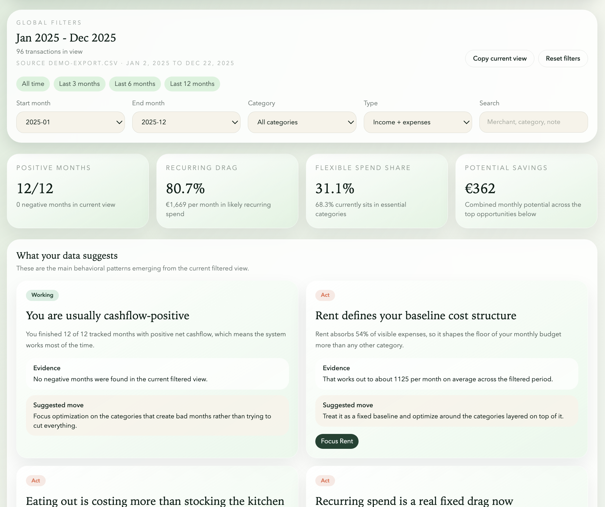
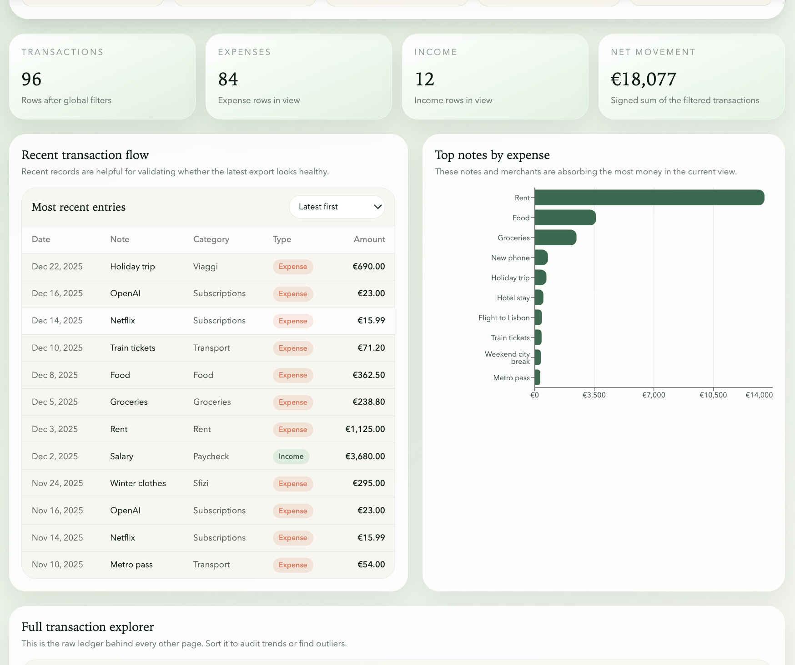
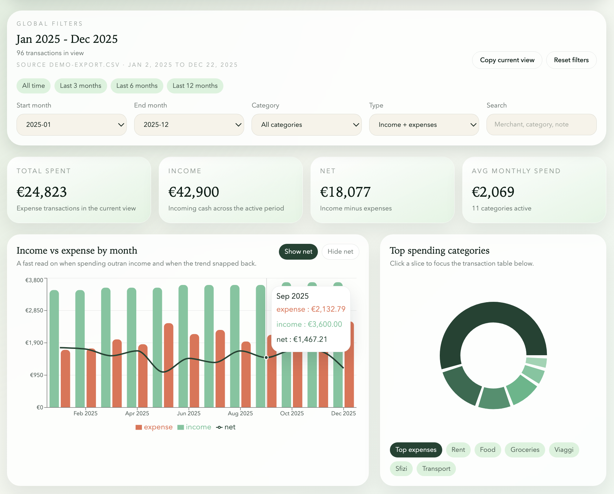
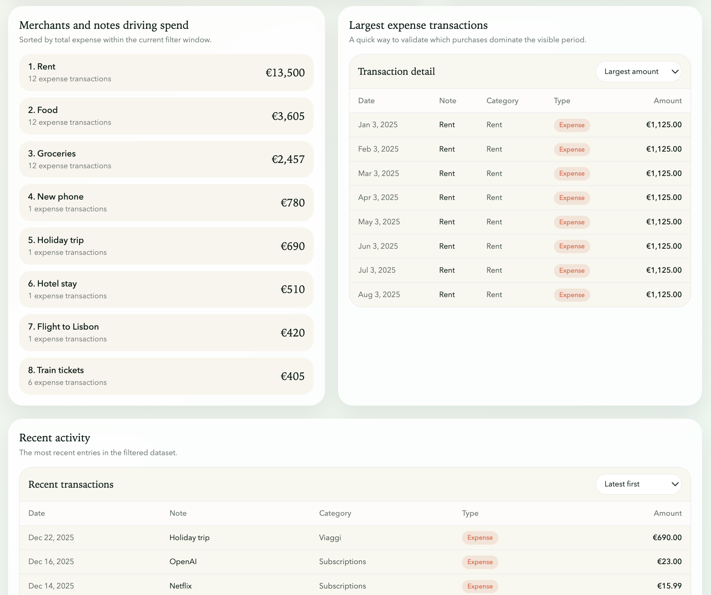
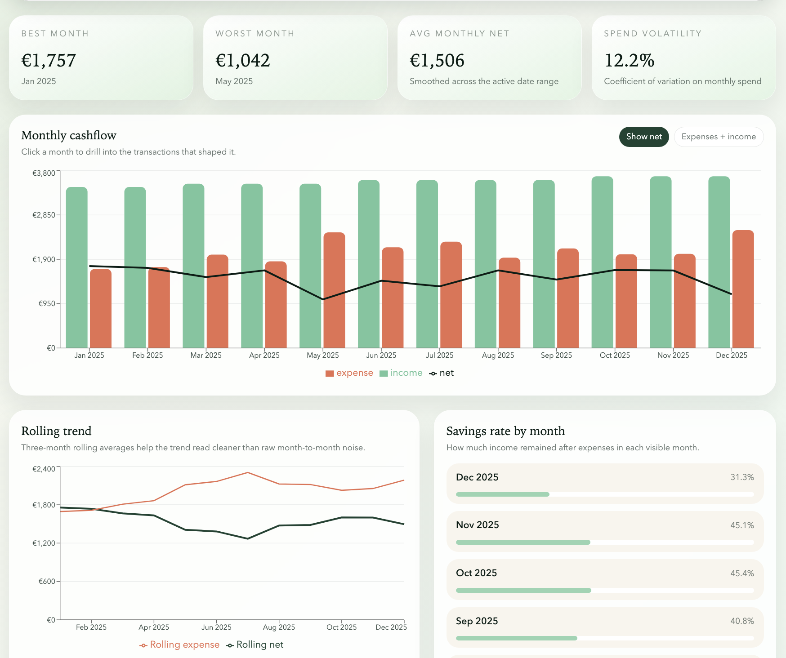
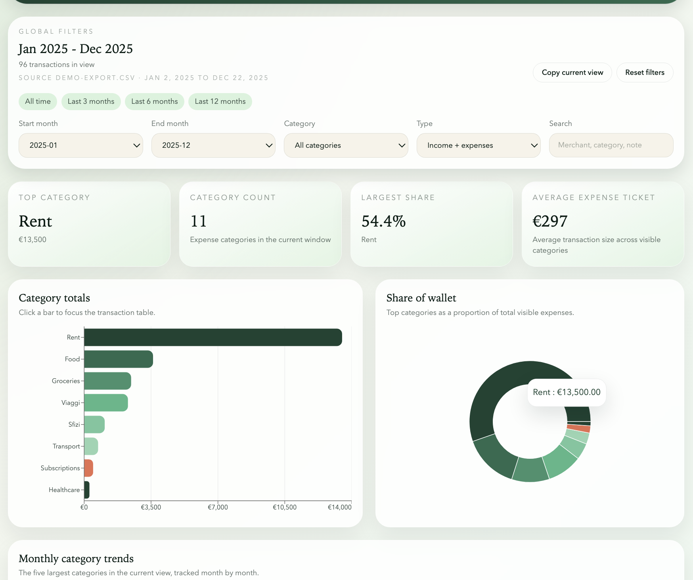
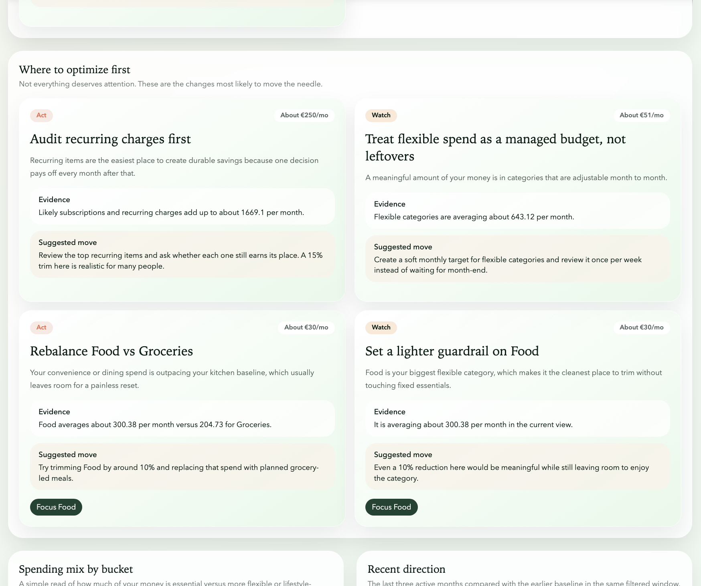
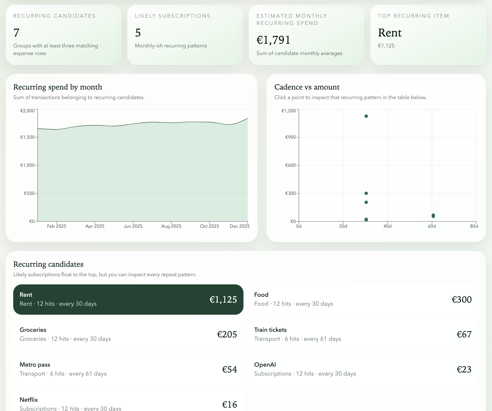

# Expense Analyzer

Expense Analyzer is a personal finance dashboard built with Astro, React islands, and a CSV-first workflow. It turns a simple export file into an interactive website for understanding cashflow, category behavior, recurring charges, anomalies, and higher-level spending insights.

## What the dashboard includes

- Overview dashboard for top-level income, expense, and net trends
- Cashflow analysis for monthly direction, rolling trends, and year-over-year comparisons
- Category analysis for spend concentration, category trends, and spike detection
- Insights page for narrative learnings and optimization opportunities
- Transactions explorer for searchable drill-down into the raw ledger
- Recurring page for subscriptions and repeated spending patterns

## Screenshots

Replace these placeholder images with real screenshots when you are ready.

### Overview


### Insights



### Transactions



## Tech stack

- Astro + TypeScript
- React islands
- Tailwind CSS
- Recharts
- Papa Parse + Zod
- date-fns
- Vitest + Testing Library
- Playwright

## How data works

The app expects a CSV with exactly these columns:

`Date,Note,Amount,Category,Type`

Rules:

- `Type` must be `Expense` or `Income`
- `Amount` is stored as a positive number in the CSV
- `Type` determines whether the row counts as positive or negative cashflow
- Dates are grouped by the calendar date embedded in the timestamp

### File loading order

The app loads CSV files in this order:

1. `input/export.csv`
2. `input/export.local.csv`
3. `input/demo-export.csv`

Use `input/export.csv` for your private local data. It is ignored by git.

The committed `input/demo-export.csv` is mock data for the public repo and GitHub Pages demo.

## Running locally

```bash
npm install
npm run dev
```

Then open the local URL shown by Astro.

Useful commands:

```bash
npm run build
npm run test
npm run test:e2e
```

## Using the dashboard

1. Start with the global filter bar at the top of each page.
2. Narrow by month range, category, transaction type, or free-text search.
3. Use the quick presets like `Last 3 months` or `Last 12 months` for faster comparisons.
4. Copy the current view from the filter bar if you want to save or revisit a specific analysis state.
5. Use the charts as navigation: several views let you click into a category or pattern and inspect the matching transactions.

## Pages

### `/`

High-level summary of your money: top KPIs, monthly income vs expense, big categories, top merchants, and recent activity.

### `/cashflow`

Monthly income, expense, net, rolling averages, savings-rate style reads, and year-over-year comparisons.

### `/categories`

Category totals, share of wallet, stacked monthly trends, and category spikes.

### `/insights`

Narrative learnings extracted from the data, plus practical optimization opportunities with supporting evidence.

### `/transactions`

A filtered transaction explorer for validating the charts against the raw rows.

### `/recurring`

Repeated charges, likely subscriptions, recurring monthly drag, and cadence/amount patterns.

## Publishing safely

This repository is designed for a public GitHub repo:

- real exports are ignored by `.gitignore`
- the public repo uses `input/demo-export.csv`
- a GitHub Pages workflow is included at `.github/workflows/deploy.yml`


## GitHub Pages

This repo includes a GitHub Pages workflow for Astro. Once the repo is on GitHub:

1. Open repository `Settings`
2. Go to `Pages`
3. Under `Build and deployment`, choose `GitHub Actions`
4. Push to `main` or `master`
5. Wait for the deploy workflow to finish in the `Actions` tab

GitHub Pages availability and workflow-based publishing are documented by GitHub and Astro:

- GitHub Pages publishing source docs: https://docs.github.com/en/pages/getting-started-with-github-pages/configuring-a-publishing-source-for-your-github-pages-site
- Astro GitHub Pages deployment guide: https://docs.astro.build/es/guides/deploy/github/

## Gallery

<table>
  <tr>
    <td align="center" width="50%">
      
      <br />
    </td>
    <td align="center" width="50%">
      
      <br />
    </td>
  </tr>
  <tr>
    <td align="center" width="50%">
      
      <br />
    </td>
    <td align="center" width="50%">
      
      <br />
    </td>
  </tr>
  <tr>
    <td align="center" width="50%">
      
      <br />
    </td>
    <td align="center" width="50%">
      
      <br />
    </td>
  </tr>
  <tr>
    <td align="center" width="50%">
      
      <br />
    </td>
    <td align="center" width="50%">
      
      <br />
    </td>
  </tr>
</table>
